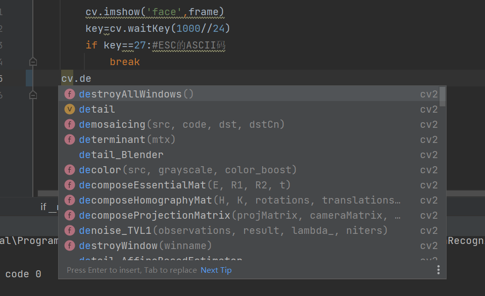
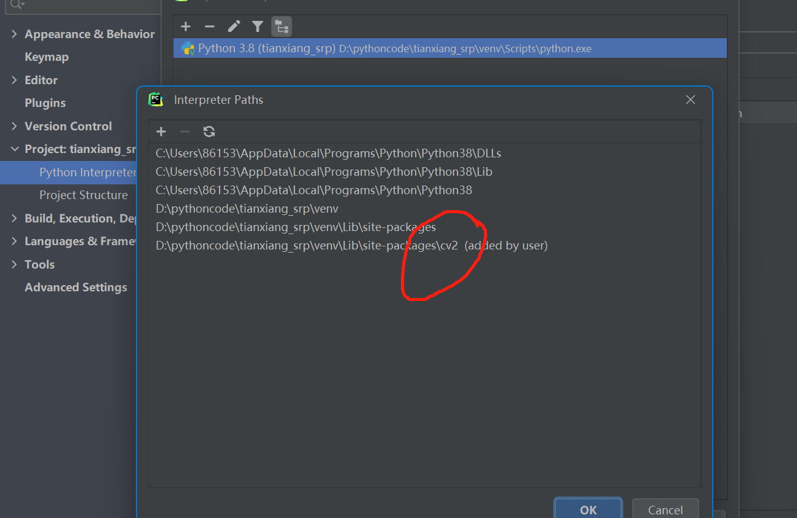
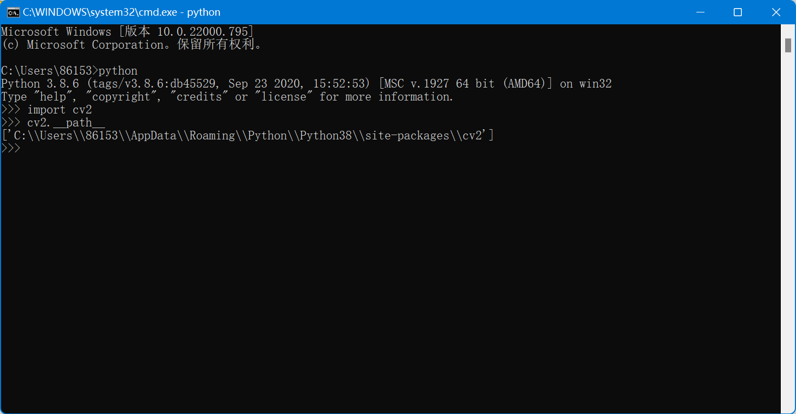
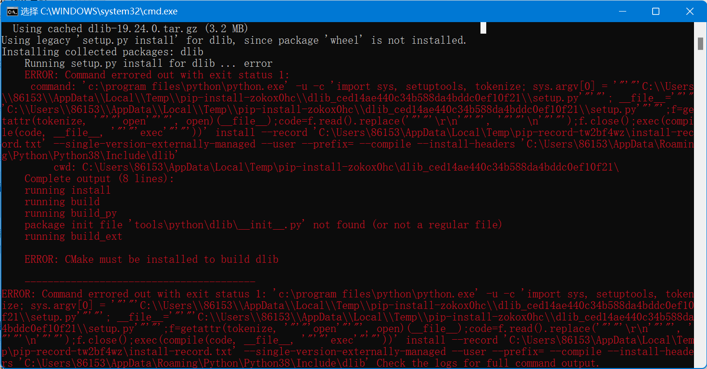

# TianXiang_srp
## Online learning status supervising system development by Tian Xiang in SCUT from 2022.4 to 2023.3
## Tips For Developers 
- 建议统一用pycharm开发维护代码，.idea文件夹为pycharm项目文件夹，[pycharm下载链接](https://www.jetbrains.com/zh-cn/pycharm/download/#section=windows)，专业版可以学校邮箱@mail.scut.edu.cn申请免费账号
- 下载opencv后，建议开启pycharm对于cv2库函数的代码提示，以提高代码编写效率，需将将cv2库文件路径添加至pycharm编译器的识别路径，关于如何查看本地cv2路径
- pip install下载dlib库，[需要cmake和VS提供编译环境](https://zhuanlan.zhihu.com/p/464846060)，
   请提前准备，否则会安装失败
## collaborators resume
---
### resignment
1. Concentration Analysis developed by Chang Peng,  Liu Xiaochen.
2. Emotion Recognition developed by Zhong Chulong, Pan Wenjie.
3. Fatigue Analysis developed by He Xie, Shi Qinger.
4. Posture Analysis developed by Wang Xunlei.
5. Application Development developed by .
---
### account info
* zcl-huazhou--zhongchulong account
* Ces0bon--panwenjie account
* Fancilia--changpeng account
* DThund--wangxunlei account
* SQE2022--shiqinger account
* 111lxc--liuxiaochen account
